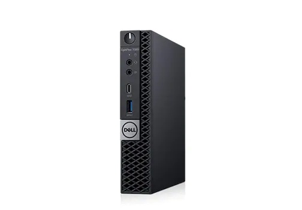

[
[

# Dell Optiplex 7060 MFF Hackintosh

具有OpenCore引導加載程序的Dell Optiplex 7060 MFF的EFI

### 電腦配置:

| Component        | Brank                              |
| ---------------- | ---------------------------------- |
| CPU              | Intel i5 8600T (4C-4T 6MB CFL)     |
| iGPU             | Intel® UHD Graphics 630            |
| Lan              | Realtek 8168                       |
| Audio            | Realtek ALC255                     |
| Ram              | 32 GB DDR4 2400 Mhz                |
| Wifi + Bluetooth | BCM943602BAED (DW1830)             |
| NVMe             | WD BK SN750 500 GB (MACOS)|
| SSD              | 預設安裝 Windows    |
| SmBios           | MacMini 8,1                        |
| BootLoader       | OpenCore 0.6.6                     |
| macOS            | Big Sur 11.2              |

## 硬體配置與設定

### 工作正常:

- [x] Intel UHD 630 iGPU HDMI/DP Output
- [x] Intel UHD 630 iGPU - H264 & HEVC
- [x] ALC255 Internal Speakers
- [x] ALC255 Native Combojack headphones
- [x] ALC255 Combojack microphone
- [x] ALC255 HDMI/DP Audio Output
- [x] ALC255 jack LINE-IN
- [x] All USB Ports 
- [x] SpeedStep / Sleep / Wake
- [x] HID Key PWRB & SLPB 
- [x] Wi-Fi and Bluetooth BCM943602BAED (DW1830) Module
- [x] CONTROLLER NVME PciE Gen3x4
- [x] CONTROLLER SATA III
- [x] All Sensors (CPU, BATTERY, NVME, SATA, FAN)
- [x] Realtek RTL8168 LAN
- [x] Apple VTD
- [x] NVRAM

### 特殊配置:

- Usb 3.0端口定製
- Applied cosmetics pci-dev

### 安裝後:

打開終端並從PostInsall / ComboJackAlc255運行install.sh。重新啟動後，插入插孔並顯示此圖像

詳見說明[ioreg](./ioregMacmini.ioreg) 

### 製作可啟動 USB macOS 安裝碟:
- 你可以參考Dortania OC 教學指南，或是[我的教學網站](https://www.imacpc.net)
- [Guide Dortania](https://dortania.github.io/OpenCore-Install-Guide/installer-guide/) - USB creation

## Bios 設定
### Enable :
* SATA Operation : AHCI
* Fastboot : Thorough
* Integrated NIC : Enable

### Disable : 
* Secure Boot
* Absolute
* TPM2.0 Security On
* Intel SGX
* Enable UEFI Network Stack
* cfg鎖定和DVMT並解鎖NVME gen3：自己承擔風險！它可能會使您的筆記本電腦變磚。

### [Bios提取轉成txt](https://github.com/Lorys89/DELL_OPTIPLEX_7060_MFF/raw/main/TOOLS%20EFI%20MOD/bios%203%207060mff%20085C.txt)
 
使用MBR映射在FAT中創建一個usb並將 [ru.efi](https://github.com/Lorys89/DELL_OPTIPLEX_3060_MFF/raw/main/TOOLS%20EFI%20MOD/RU.efi) 然後轉到BIOS，並創建一個帶有usb路徑的條目，並設置ru.efi文件和您選擇的啟動名稱，然後發送並最終單擊應用。

重新啟動並在您最後創建的條目中按f12鍵，單擊任意鍵，然後單擊alt +ì，將出現一個菜單並滾動到CpuSetup並單擊Enter，在新屏幕中，將值05BE上的箭頭與之進行更改。從01到00，然後單擊Enter，然後按ctrl + w保存，然後按alt + q退出。繼續檢查您的CFG LOCK是否已解鎖。

對於DVMT pre，所有值都必須轉到“設置”菜單，然後輸入並查找08DC並將其設置為01到02（值02表示64MB pre），然後移動並用ctrl + w保存並退出alt + q，您將獲得適用於igpu的DVMT值。

若要將NVME從GEN2解鎖到GEN3，您必須進入“設置”菜單，進入並查看照片，並將值設置為02到03，然後移動並使用ctrl + w保存並退出alt + q，您將擁有NVME工作到GEN3

## Credits

- [Apple](https://apple.com) for macOS;
- 感謝 [Acidanthera OC 開發團隊們](https://github.com/acidanthera) 對Hackintosh 的無私奉獻和工作
- 感謝 [Dortania](https://dortania.github.io/OpenCore-Install-Guide/config-laptop.plist/icelake.html) 寫出這麼詳盡的OC設定教學
- [我和我的黑蘋果](https://www.facebook.com/groups/ihackintosh) 

# 有任何的問題或是需要，隨時都可以來參加我的社團 [Web](https://www.imacpc.net/)
